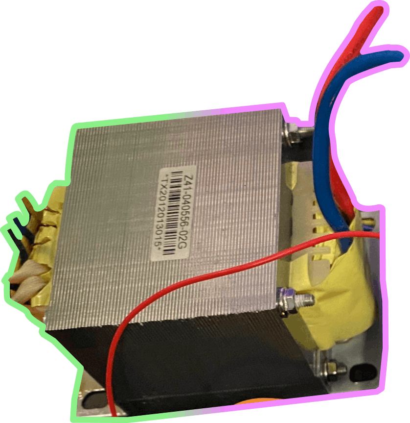

## Capturing the B-H Curve of a Transformer Core Material Using Arduino

    

        
            <svg viewBox="0 0 24 24" width="14" height="14" aria-hidden="true" style="opacity:1;">
                <rect x="3" y="4" width="18" height="18" rx="2"
                      fill="none" stroke="currentColor" stroke-width="1.5"/>
                <path d="M16 2v4M8 2v4M3 10h18"
                      fill="none" stroke="currentColor" stroke-width="1.5"/>
            </svg>
            December 12, 2025
        
        

            Circuit design
            Magnetics
            python-matlab
            fem
        

    

    

   

Capturing the **B–H curve** of a transformer core material requires at least a dual-channel oscilloscope. In this project, my goal was to make this experiment possible using low-cost hardware available to almost **everyone**. By relying on:
- an Arduino,
- a simple op-amp, 
- and basic passive components. 
The transformer itself:

The Basics

The hysteresis loop is the **XY** plot of the magnetic field intensity (**H**) versus the magnetic flux density (**B**).

  <video class="theme-video light-video" autoplay muted loop playsinline controls preload="auto">
    <source src="../assets/Hyst_EQ_white.mp4" type="video/mp4">
  </video>
  <video class="theme-video dark-video" autoplay muted loop playsinline controls preload="auto" >
    <source src="../assets/Hyst_EQ_black.mp4" type="video/mp4">
  </video>

 
Using **Ampère’s** and **Faraday’s laws**, the initial problem is transformed into an XY plot of the primary winding **current** and the integral of the secondary winding **voltage**.

Current Sensing

An op-amp configured as a **non-inverting amplifier**, together with a **DC offset circuit**, is used to measure the voltage drop across a sensing resistor. The primary current is then calculated using Ohm’s law.

Voltage sensing is implemented using a simple voltage divider and a DC offset circuit, while the integration is performed during post-processing of the captured data.

Results

Successfully captured the B–H hysteresis loop of a transformer core using **low-cost** hardware based on an Arduino platform.

  <video class="theme-video light-video" autoplay muted loop playsinline controls preload="auto">
    <source src="../assets/Hyst_white.mp4" type="video/mp4">
  </video>
  <video class="theme-video dark-video" autoplay muted loop playsinline controls preload="auto">
    <source src="../assets/Hyst_black.mp4" type="video/mp4">
  </video>

 
The primary **current** waveform is clearly **non-sinusoidal**, reflecting the nonlinear magnetic behavior of the transformer core.

Considering Time

Take a look at how the hysteresis loop is formed at each measurement step. When plotted in 3D with time as the third axis, the result looks like a helix, which brings Euler’s formula to my mind.

  <video class="theme-video light-video" autoplay muted loop playsinline controls preload="auto">
    <source src="../assets/3dplot_white.mp4" type="video/mp4">
  </video>
  <video class="theme-video dark-video" autoplay muted loop playsinline controls preload="auto">
    <source src="../assets/3dplot_black.mp4" type="video/mp4">
  </video>

A short **FEM simulation** video is also included, showing the saturation of the material (note that B values are not displayed, as the focus is on the waveform shape and key characteristic points).

<!-- style="width: 25%;"  -->
